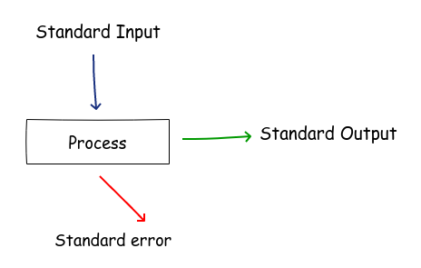
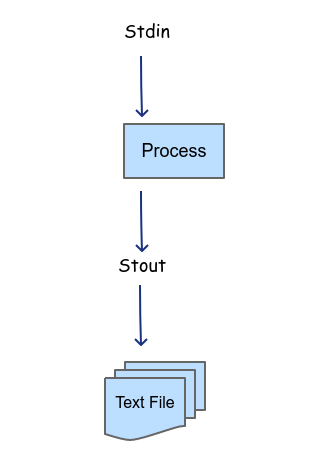
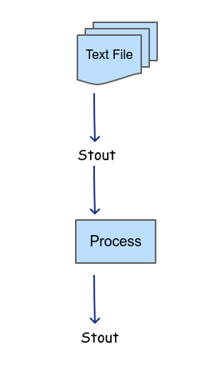

# Some useful shell scripts

Because Linux has its conceptual roots in the older Unix operating system, many applications are designed to be executed from a command line. Linux has two user interfaces: The command Line and the Graphical User Interface (GUI).

<h3>What is a Shell?</h3>

In UNIX, the parent operating system of Linux, a command interpreter is a Shell.
A shell is an environment where we can run commands, programs, and others shell scripts. The UNIX operating system popularised many of the ideas about shell scripting.

Linux offers many different shells, however, Bash has become the default standard on Linux.
Bash understands a whole of standard Linux commands or can run any command stored in an executable file. In addition, it can also execute shell scripts (text files that contain Linux commands).

You build a small and simple utility and we use it as one link in a string of others to form a command. The shell acts as the interface between you and the Linux System, allowing you to enter commands for the operating system to execute.

<b>Fig 1. Linux architecture</b>

The purpose of the shell is to start processes running your commands. The shell stays between the user (you) and the system. The command is not directly executed; rather, the shell reads the input, interprets the command and then creates the process that executes the command.

<h3>Why Use the Command Line?</h3>

Linux provides thousands of shell utilities that range from simple programs for creating, examining, and modifying files and hardware configurations to complex utilities that enable low-level capabilities such as file systems, security and networking.

The basic concept of a shell script is a list of commands, which are listed in the order of execution. Shell scripts are interpreted. They are ASCII text that is read and executed by the shell interpreter. When we execute a shell script, the shell interpreter goes through the ASCII text line by line, and executes each statement, as each line is reached from the top to the bottom.

 All shell commands have this general format:

<pre>
command option1 option2... optionN
</pre>
<h3>Processes</h3>

Linux is a multiprocessing operating system. This means that several processes can be executed simultaneously. By definition, a process as an instance of an executing program. If the same program is being executed twice, it requires two processes. Everything done on a Linux system is done by a process.
It is important to emphasize that a process is not a program. A process is an environment within which a program executes. 
By default, every process, when created, is connected to three default streams: <b>standard input</b>, <b>standard output</b>, and <b>standard error</b>. We can see it in the following image.

<b>Fig 2. Every process has three default streams.</b>

All three standard streams are connected to the process’s controlling terminal, by default the input stream is the keyboard and the screen is the output and error streams respectively.

<h3>Pipelines</h3>

Because process is independent of the program it executes and the data it processes. The process does not care how the data it is using is generated or consumed. This mechanism allows the output of one process to be connected to the input of another.

<b>Fig 3. Pipeline using one process.</b>

Anything done by a pipeline can also be done by storing the output of process A into a file or using a file as input for another process.

<b>Fig 4. Pipeline using a file as an input.</b>

You can get the following scripts in the src folder:

<ol>
<li><b><a href="src/countFolders.sh">countFolders.sh</a>:</b> Counts the total number of folder in a given path.</li>
<li><b><a href="src/countFiles.sh">countFiles.sh</a>:</b> Counts the total of files in a given path (same logic that countFolder).</li>
<li><b><a href="src/convertLower2Upper.sh">convertLower2Upper.sh</a>:</b> convert the files names of a given path to Uppercase.</li>
<li><b><a href="src/convertUpper2lower.sh">covertUpper2lower.sh</a>:</b> convert the files names of a given path to Lowercase.</li>
<li><b><a href="src/burnfolder2iso.sh">burnfolder2iso.sh</a>:</b> makes the iso image of a given folder.</li>
<li><b><a href="src/PgAgent.sh">PgAgent.sh</a>:</b> starts or stops a PostgreSQL database.</li>
<li><b><a href="src/killmyprocess.sh">killmyprocess.sh</a>:</b> kills a process running by the user.</li>
<li><b><a href="src/showFrequencyWords.sh">showFrequencyWords.sh</a>:</b> Displays the word frequency in a text file.</li>
<li><b><a href="src/showFileSize.sh">showFileSize.sh</a>:</b> Displays the size of the files of a given path.</li>
</ol>

<b>References:</b>

Swart,R.[1990]<cite>UNIX Applications Programming: Mastering the Shell,USA,<b>SAMS</b></cite>

