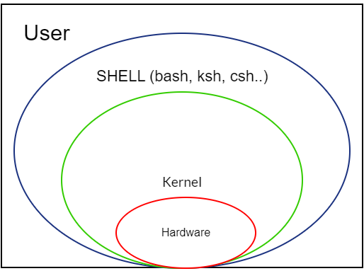

# Some useful shell scripts

<h3>What is a Shell?</h3>

A shell is an environment in which we can run commands, programs and others shell scripts. The UNIX operating system popularized many of the ideas about shell scripting.
In UNIX, which is the parent operating system of Linux, you build a small and simple utility and we use it as one link in a string of others to form a command.
The shell acts as the interface between you and the Linux System, allowing you to enter commands for the operating system to execute.

<b>Fig 1. Linux architecture</b>

The basic concept of a shell script is a list of commands, which are listed in the order of execution.
Shell scripts are interpreted. They are ASCII text that is read and execute by the shell interpreter.
When we execute a shell script, the shell intepreter goes through the ASCII text line by line, and executes each statement, as each line is reached from the top to the bottom.

<ul>
<li><b>countFolders.sh:</b> Counts the total number of folder in a given path.</li>
<li><b>countFiles.sh</b> Counts the total of files in a given path (same logic that countFolder).</li>
<li><b>convertLower2Upper.sh:</b> convert the files names of a given path to Uppercase.</li>
<li><b>covertUpper2lower.sh</b> convert the files names of a given path to Lowercase.</li>
<li><b>burnFolder2iso.sh</b> makes the iso image of a given folder.</li>
</ul>

